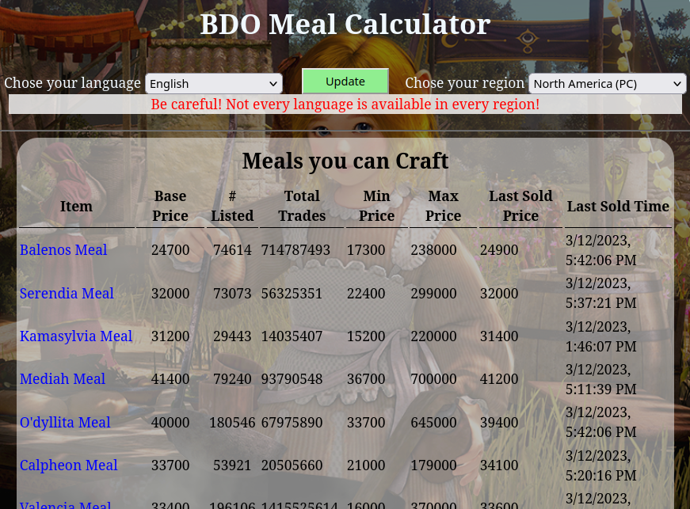

# BDO_Meal-Calculator

> API Call from Black Desert Marketplace API

## Table of Contents
  - [General Information](#general-information)
    - [Technologies Used](#technologies-used)
    - [Features](#features)
    - [Screenshots](#screenshots)
    - [Setup](#setup)
    - [Usage](#usage)
    - [Current Status](#current-status)
  - [Room For Improvement](#room-for-improvement)
  - [Acknowledgements](#acknowledgements)
  - [Contact](#contact)
  - [License](#license)

## General Information
  - Displays information regarding in-game meals, recipes, ingredients, and their associated costs.
  - Utilizing this tool allows for quick and easy decision making for buying meals/ingredients or crafting.
  - Allows the user to drill down from the main meal into the lowest item/ingredient used to make it.

## Technologies Used
  > HTML, CSS, JavaScript, jQuery, BDO Marketplace API

## Features
  - Retrieves listing of all items, recipes, and material groups in the game.
  - Allows the user to find craftable dishes and how to make them.
  - Retrieves the current purchase amount and how many are listed by other players.
  - Calculates the cost of any given recipe/ingredient to allow the user to decide if it is better to craft it or buy it.

## Screenshot(s)
  > 

## Setup
  - None needed. Click on demonstration link below.
  - Or to run locally, copy all files into a local directory and point your browser to index.html.
  
[Project Demonstration](https://amoramas.github.io/BDO_Meal-Calculator/)

## Usage
  1. Verify language and region at top, then click update button.
  1. Click on a meal name amongst the rows of available choices.
  1. Scroll down and select sub meals/ingredients you want further information on.
  1. Verify price and availability information to determine if you should craft it or buy it when available.

## Current Status
  > Complete

## Room For Improvement
  - Ideas:
    - Allow for user selectable filtering options.
    - Select region from Console/PC
    - Only show languages that are available per selected region
  - Todo:
    - None at present

## Acknowledgements
  - ### Inspired By:
    - My enjoyment of the Black Desert Game and not seeing this feature available anywhere
  - ### Based On:
    - https://documenter.getpostman.com/view/4028519/TzK2bEVg
  - ### Contributors:
    - N/A

## Contact
  > [amoramas1984@gmail.com](mailto:amoramas1984@gmail.com)

## License
  > 